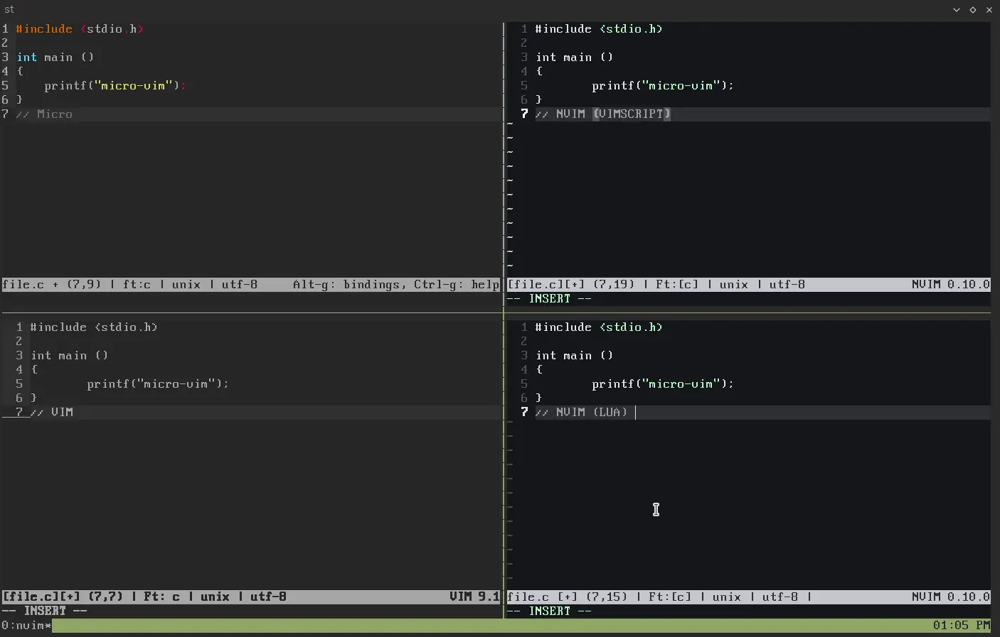

# micro-vim
Micro style for nvim

Micro at the top, NeoVim at the bottom-left, Vim at the bottom-right

❌ : Not Started
✅ : Done
🔄 : In Progress

to do:                 | . |
---------------------- | --|
 remap keys            | 🔄|
 Create optional conf in lua   | ✅|
 Direct replace when selecting | ❌|
 see find on realtime (insert mode) | ❌|
 get micro-like GUI    | ✅ |
 get micro-like statusbar | ✅ |
 Select all on (insert) Visual to no press "i" after this| ❌|

 
## Available Keybinds

Keybind| Do           | Vim Keybind|
-------| ------------ | -   |
Ctrl+C | Copy         | Y   |
Ctrl+X | Cut          | D   |
Ctrl+V | Paste        | P   |
Ctrl+Z | Undo         | U   |
Ctrl+Y | Redo         | Ctrl+R  |
Ctrl+F | Find         | /   |
Ctrl+F | Find and replace | :s  |
Ctrl+A | Select all   | ggVG (only normal mode)  |
Ctrl+E | Command      | :   |
Ctrl+Left | Col Nav Left | H   |
Ctrl+Right | Col Nav Right | L   |
Ctrl+D | Duplicate Line | :t.|
Ctrl+K | Delete Line  | :.d |
Ctrl+P | Insert File  | P   |
Ctrl+O | Open File    | :e  |
Ctrl+S | Save File    | :x  |
Ctrl+Q | Quit (ask to save)| :wq, :q, :q! |
Ctrl+/ | Go to line   | :# (:64 for example) |
Alt+\  | Go to Firt Line | gg |
Alt+/  | Go to Last Line | G |
Alt+Left | Word Nav Left | B |
Alt+Right | Word Nav Right | w |

## Unchanged Keybinds

Keybind| Do           |
-------| ------------ |
Esc    | Exit mode    |
I      | Insert Mode  |
V      | Visual Mode  |

